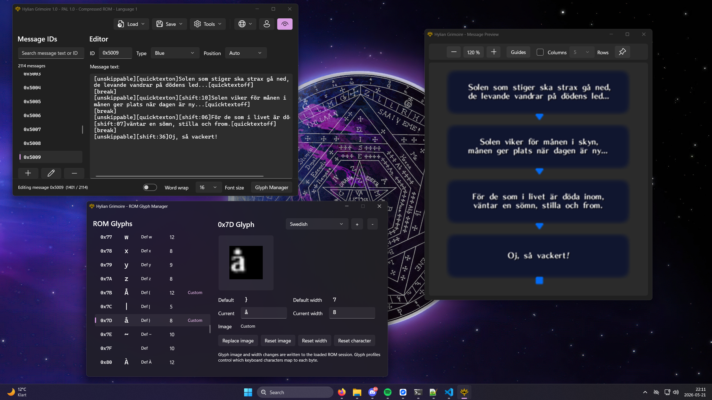
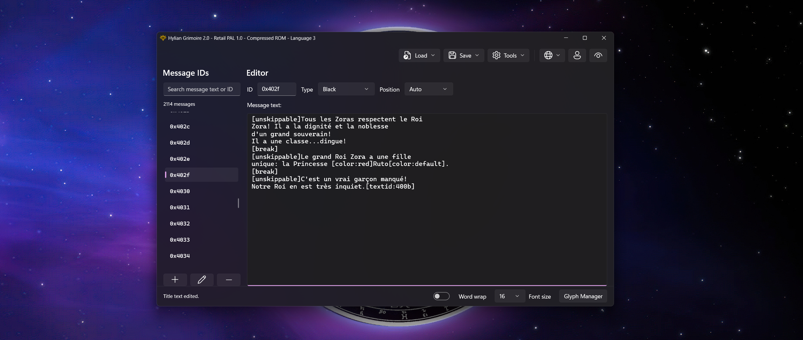
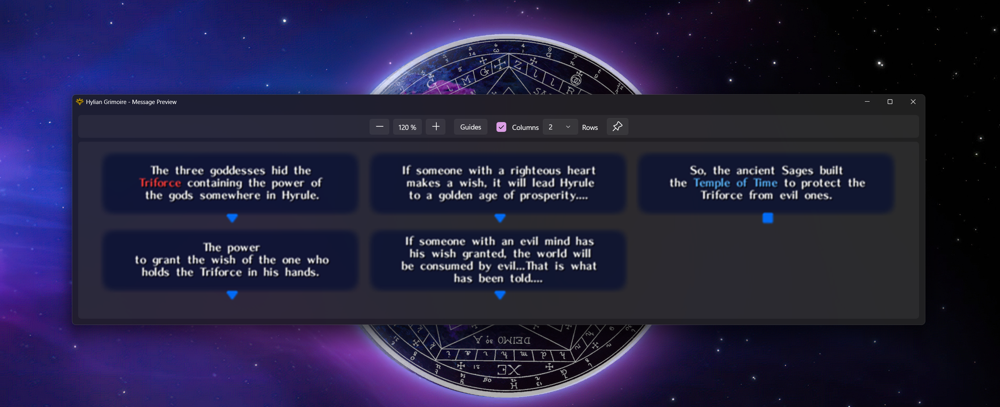
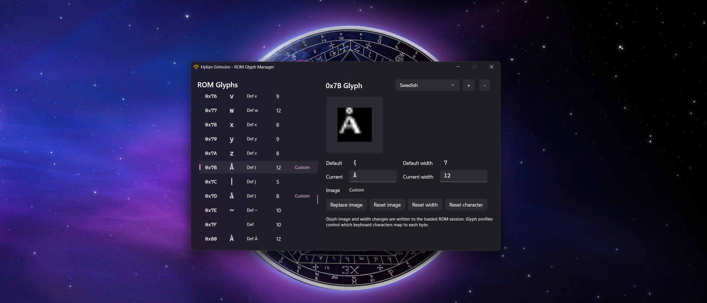
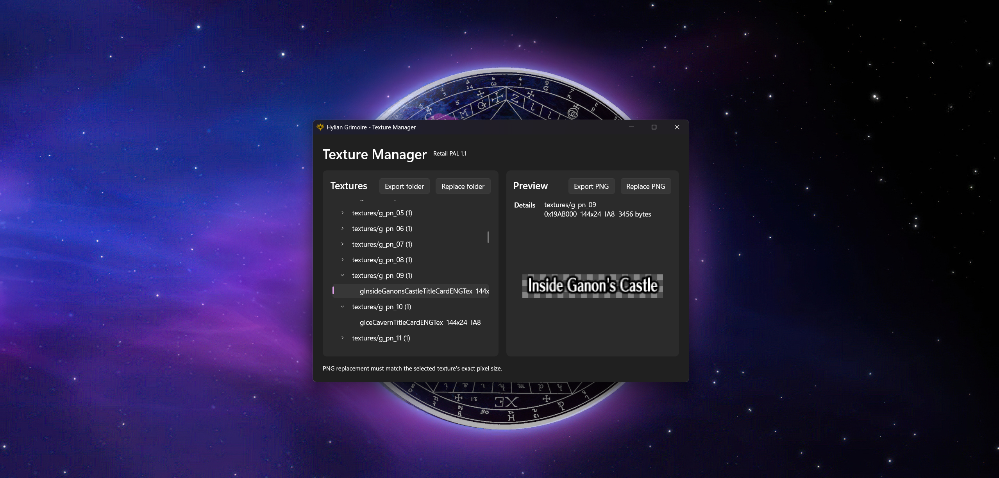
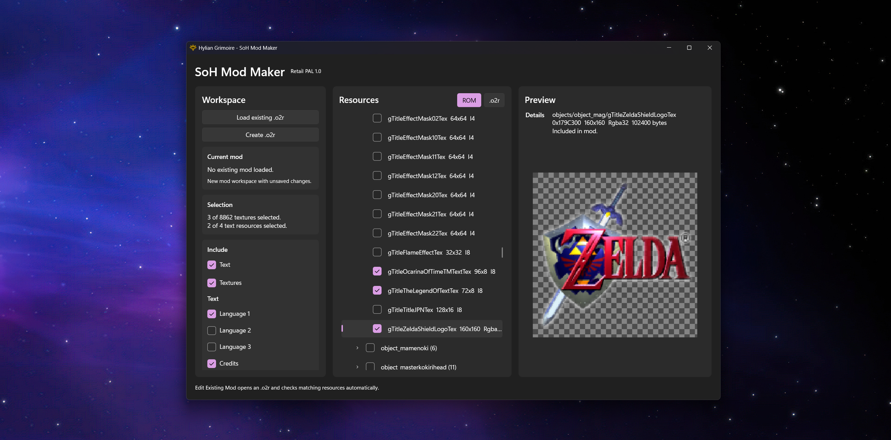
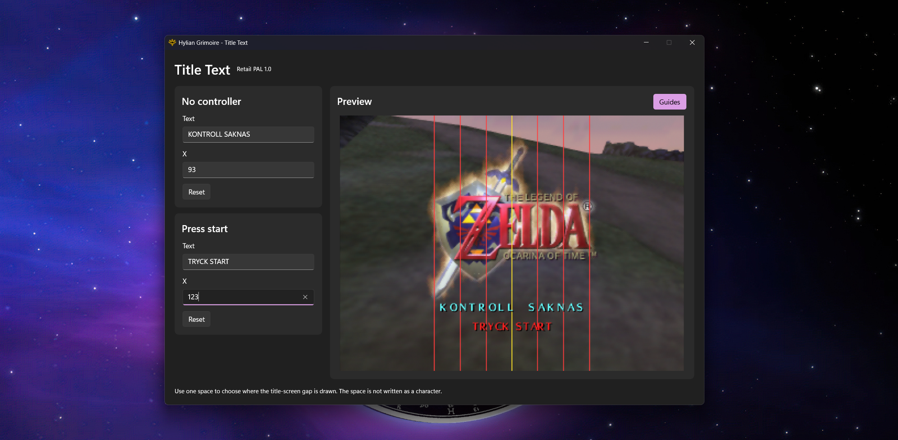
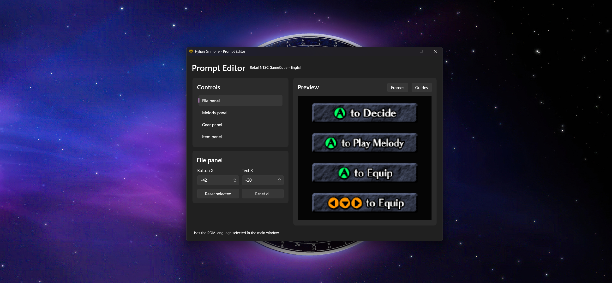
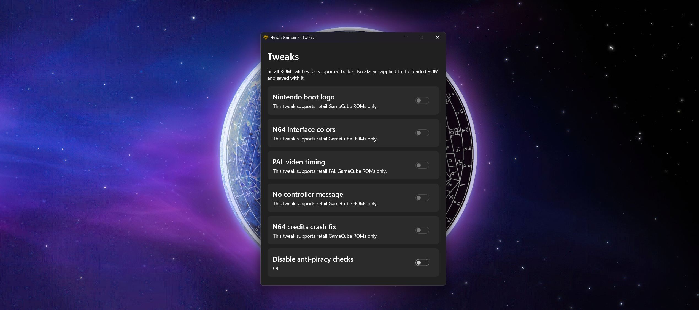

# Hylian Grimoire



Hylian Grimoire is a Windows desktop editor for **The Legend of Zelda: Ocarina of Time** and **The Legend of Zelda: Majora's Mask** message projects. It is built for translation and ROM editing workflows where readable text editing, decomp-friendly headers, game-aware metadata, and exact binary round-tripping all matter.

The editor works with extracted message files, C message headers, and `.z64` ROMs. ROM workflows support compressed and decompressed ROMs, game/version detection, message-bank switching, glyph editing, and version-aware tools that stay disabled when a loaded project cannot safely use them.

## Features

- Load and save message `.bin` / `.tbl` files.
- Load and save `.z64` ROMs, including compressed and decompressed ROM workflows.
- Detect supported ROM profiles automatically.
- Import and export C message headers in modern decomp-style, legacy, and OTRMod-oriented formats.
- Import headers into ROM message banks when the imported data fits the selected ROM section.
- Work with multi-language ROM message banks, including PAL / EU language banks.
- Edit normal message text, credits text, and game-specific message metadata.
- Search message IDs by ID or message text.
- Add, rename, delete, and reorder message IDs.
- Preview message boxes with game-style text rendering, item icons, colors, choices, highscore tokens, ocarina staff display, credits text, and multi-box messages.
- Open the preview in a separate window with zoom, column layout, alignment guides, and always-on-top support.
- Manage game-specific glyph profiles for editor display characters, glyph images, and preview glyph widths without accidentally changing the intended byte values.
- Read glyph images and widths directly from ROMs, edit them in the Glyph Manager, and write the changes back to the ROM.
- Export and replace supported ROM textures as PNG files with exact byte-preserving round-tripping.
- Create and edit SoH `.o2r` mod files with selected text and texture resources.
- Remap glyph byte usage across the active script.
- Edit supported ROM title-screen text.
- Edit supported pause-menu prompt positions.
- Apply version-aware ROM tweaks from the Tools menu.
- Follow Windows light/dark mode through WinUI 3 and Windows App SDK.

## Message Editing



The main editor is built around fast navigation, readable message syntax, and exact save/export behavior. Messages can be searched by ID or text, edited directly, reordered, imported from headers, exported back to headers, or written into ROM message banks.

Ocarina of Time and Majora's Mask expose different metadata surfaces. Ocarina of Time messages use textbox type and position metadata. Majora's Mask messages also expose game-specific fields such as icon, next ID, prices, centered text, unskippable text, and instant text where the loaded ROM/profile supports them.

## Header Workflows

Hylian Grimoire treats C message headers as real project files, not disposable export output. It supports modern multi-language decomp-style headers, legacy headers, and OTRMod-oriented output, while keeping control codes, item icons, language slots, and readable formatting intact wherever possible.

Headers can be loaded directly, exported from data files or ROMs, and imported into ROM message banks. For multi-language ROMs, the editor can work with a selected language or export all ROM languages in a modern header layout.

Glyph profiles are kept separate from canonical header text. A custom editor glyph can display byte `0x7B` as `å` in the editor, but header export still writes the canonical header character for that byte. This keeps exported headers usable with decomp projects and prevents visual glyph substitutions from leaking into source files.

## Message Preview



The preview window renders message boxes with game-style glyphs, colors, item icons, choices, ocarina staff display, credits text, multi-box messages, zoom controls, columns, and alignment guides.

Preview rendering is game-aware. Ocarina of Time and Majora's Mask use separate syntax, glyph sources, icon handling, and baseline metrics.

## Glyph Manager



The Glyph Manager is designed for translation projects that need custom characters. Glyph profiles can change which character a byte displays as, replace the preview image, and adjust the preview width while keeping the underlying byte value stable. For example, a profile can make byte `0x92` appear as `å` in the editor while still saving byte `0x92` to message data.

Glyph profiles are scoped by game. Ocarina of Time and Majora's Mask keep separate original encodings, profile snapshots, preview glyphs, and ROM glyph resources.

In ROM mode, Hylian Grimoire can read glyph images and widths directly from the loaded ROM, compare them against the expected baseline, and write image or width changes back into the ROM. This makes it possible to inspect and edit custom ROM fonts without treating them as separate loose assets.

When saving or exporting, text characters must be encodable by the active glyph profile. If a message contains an unsupported character, the save is stopped and the affected message ID is reported instead of silently writing an invalid byte.

## Texture Manager



The Texture Manager exports and replaces supported Ocarina of Time and Majora's Mask NTSC-U ROM textures as PNG files. It uses the loaded ROM profile to expose the relevant texture groups, keeps alpha visible in the preview, and validates replacement images against the exact expected dimensions and encoded byte length before writing anything back.

Folder export and folder replace use the same grouped texture layout, making it practical to work on many image assets at once while still preserving exact binary round-tripping.

## SoH Mod Maker



The SoH Mod Maker creates and edits Ocarina of Time `.o2r` mod files from the resources Hylian Grimoire already understands. It can include selected texture resources, selected text resources, or both, and it can load an existing mod so its current contents can be inspected before saving a new version.

Texture resources use the same catalog and naming as the Texture Manager, so exported/replaced assets and mod resources stay consistent. When a loaded `.o2r` already contains resources that differ from the loaded ROM, Hylian Grimoire warns before overwriting them.

## Title Text



The Title Text tool edits title-screen text with a live preview. It keeps the title text constraints visible so changes can be made deliberately instead of by trial and error.

For Ocarina of Time, supported profiles include no-controller text and press-start text where available. For Majora's Mask, supported profiles focus on press-start text, including localized EU/GameCube variants.

## Prompt Editor



The Prompt Editor adjusts pause-menu prompt placement for supported ROMs. The live preview shows the prompt graphics directly from the loaded ROM, with optional guides and frames for careful alignment.

Ocarina of Time profiles cover the file, melody, gear, and item panel prompts. Majora's Mask profiles use the Majora's Mask-specific prompt layout exposed by the loaded ROM profile.

## Tweaks



The Tweaks window exposes ROM patches as simple on/off switches. Each tweak is version-aware, so unavailable options stay disabled instead of applying unsafe changes.

Tweaks are grouped by the active game profile. Ocarina of Time and Majora's Mask have separate tweak surfaces, and ROM-specific tweaks only enable when the loaded ROM profile, compression state, and binary data match the patch requirements.

## Editor Syntax

Messages are shown as editable text with bracketed tags for control codes. For example:

```text
[unskippable][item:30][quicktexton]Du bytte [color:red]Kojiro[color:default]!
[break]
Denna konstiga svamp försvinner
om du inte levererar den i tid!
```

Common Ocarina of Time tags include:

- `[break]`
- `[breakdelay:xx]`
- `[color:red]`
- `[color:default]`
- `[item:30]`
- `[sfx:Laugh2]`
- `[Triangle]`
- `[twochoice]`
- `[threechoice]`

Majora's Mask uses its own compatible editor syntax for its message commands, header metadata, icons, colors, and control codes.

The editor syntax is intended to be readable while preserving the original encoded data as closely as possible.

## Build

Requirements:

- Windows 10 1809 or newer, Windows 11 recommended
- .NET 8 SDK

Build from the repository root:

```powershell
dotnet build .\HylianGrimoire.slnx -c Release
```

Run from source:

```powershell
dotnet run --project .\src\HylianGrimoire\HylianGrimoire.csproj -c Release
```

Run tests:

```powershell
dotnet test .\HylianGrimoire.slnx -c Release
```

Run the full local verification pass:

```powershell
.\tools\verify.cmd
```

## Local ROM Test Fixtures

Most tests run without external ROM files. A subset of ROM parity tests can use local fixtures when they are available. The preferred local layout is:

```text
.local/rom-fixtures/
  oot/
    oot_retail_ntsc_1.0_decompressed.z64
    oot_retail_pal_gc_decompressed.z64
  mm/
    mm_us_n64_compressed.z64
    mm_us_n64_decompressed.z64
    mm_eu_1.1_n64_decompressed.z64
```

The `.local` directory is intentionally ignored by Git. ROM files are never stored in source control.
Only ROM fixtures used by the default local parity tests need to live here; generated headers, probe files, scratch saves, and temporary test ROMs are not required.

The test helper looks for `.local/rom-fixtures` first. You can still override fixture locations with environment variables when needed:

- `HYLIAN_GRIMOIRE_ROM_FIXTURE_ROOT`: root containing `oot` and/or `mm`; legacy roots with `compressed`, `decompressed`, `retailcompressed`, `retaildecompressed`, and `majorasmask` are still supported
- `HYLIAN_GRIMOIRE_MAJORAS_MASK_FIXTURE_ROOT`: optional override for Majora's Mask fixtures
- `HYLIAN_GRIMOIRE_RETAIL_DECOMPRESSED_ROOT`: optional override for retail decompressed Ocarina of Time fixtures

For compatibility, the tests can still fall back to discovering an older fixture root by walking up from the test output directory.

## Project Structure

```text
src/HylianGrimoire.Core/         Core library for codecs, games, ROM handling, headers, services, sessions, and testable domain logic
src/HylianGrimoire/              WinUI 3 application, windows, dialogs, app assets, and UI composition
src/HylianGrimoire/Assets/       Runtime visual/font/texture assets copied into the app output
src/HylianGrimoire/Interop/      Windows window theming, icons, sizing, cursor, and native interop helpers
src/HylianGrimoire/Soh/          Ocarina of Time SoH .o2r mod creation and resource packing
tests/HylianGrimoire.Tests/      xUnit tests for codecs, import/export, ROM round-tripping, tools, sessions, and workflow parity
tools/                           Local helper tools and scripts
media/                           README screenshots
```

Important core areas:

```text
Codecs/                          Message byte encoding, decoding, token maps, and editor syntax
Compression/                     Yaz0 and raw deflate codecs
Games/                           Game profiles, capabilities, assets, and game-specific catalogs
Glyphs/                          Glyph metadata, glyph profiles, snapshots, and glyph sources
Headers/                         Ocarina of Time and Majora's Mask C header import/export
Models/                          Message entries, message tokens, metadata, and tool state models
Preview/                         Game-style preview layout/rendering logic
PromptEditor/                    Pause-menu prompt placement editing support
Rom/                             ROM detection, compression, DMA tables, message banks, font resources, and checksums
Services/                        File workflows, search, document/session services, tool availability, and runtime profile access
Sessions/                        Active document/session state and dirty tracking
Textures/                        ROM texture catalogs and texture codecs
TitleText/                       Title-screen text editing support
Tweaks/                          Version-aware ROM tweaks
```

Version metadata lives in `Directory.Build.props`. The WinUI project references `HylianGrimoire.Core`, and the test project references the core library directly.

## Notes

Hylian Grimoire is a standalone editor project. It is meant for extracted message files, ROM workflows, and project workflows where exact save/export behavior matters. Keep backups of your source `.bin`, `.tbl`, header, and ROM files when working on real translation or modding projects.
